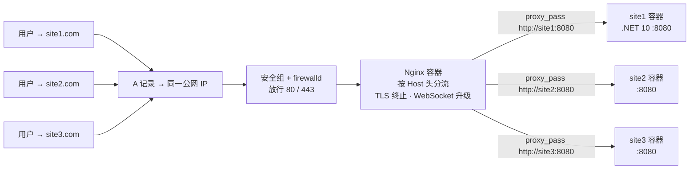

# Docker 多站点部署方案 —— 同一公网 IP · 多域名

> 目标环境：Alibaba Cloud Linux 3.2104（OpenAnolis Edition）
> 部署方式：Docker + Docker Compose + Nginx 反向代理 + HTTPS（Let's Encrypt / Caddy）
> 适用场景：一台服务器、一个公网 IP，托管多个网站（Blazor / ASP.NET Core / 任意 Web 服务）

---

## 1. 方案总览

### 1.1 架构

```
                        ┌──────────────────────────────────────────────┐
  site1.com  ──┐        │              服务器（一个公网 IP）              │
  site2.com  ──┤  A记录  │                                              │
  site3.com  ──┘ ──► IP │  ┌──────────┐    ┌──────────────────────┐    │
                        │  │ 安全组    │    │ Nginx 容器（80/443）   │    │
                        │  │ firewalld │──►│ 按 Host 头分流         │    │
                        │  │ 放行80/443│    │ TLS 终止 · WS 升级     │    │
                        │  └──────────┘    └──────┬───────┬───────┘    │
                        │                         │       │            │
                        │          ┌──────────────┘       └──────────┐ │
                        │          ▼                                ▼ │
                        │  ┌──────────────┐              ┌──────────────┐
                        │  │ site1 容器    │              │ site2 容器    │
                        │  │ :8080        │              │ :8080        │
                        │  │ BlazorLearn  │              │ 站点 B / C   │
                        │  └──────────────┘              └──────────────┘
                        │        Docker Compose 内部网络（服务名互通）
                        └──────────────────────────────────────────────┘
```



### 1.2 关键特性

| 项目 | 方案 |
| --- | --- |
| 端口占用 | 公网只开放 80/443；各站点容器内部用 8080，互不冲突 |
| 站点隔离 | 每个站点独立容器、独立镜像、独立数据卷 |
| HTTPS | Let's Encrypt 自动签发/续期（certbot 容器），或 Caddy 全自动 |
| Blazor Server | Nginx 反代已配置 WebSocket 升级头（SignalR 必需） |
| 数据持久化 | SQLite 等文件数据用命名卷保存，容器重建不丢数据 |

---

## 2. 前置准备

### 2.1 服务器要求

- 系统：Alibaba Cloud Linux 3.2104（本方案按此编写）
- 内存：建议 ≥ 2GB（每个 .NET 应用运行时约占 200~500MB）
- 公网 IP：1 个（已确认可从公网访问）
- 端口：80、443 需可从公网访问（安全组 + 防火墙）

### 2.2 域名与 DNS

每个域名添加两条 A 记录，全部指向**同一个公网 IP**：

| 主机记录 | 记录类型 | 记录值 |
| --- | --- | --- |
| `@` | A | 你的公网 IP |
| `www` | A | 你的公网 IP |

> 本文以 `site1.com`、`site2.com`、`site3.com` 为示例域名，部署时全部替换为你的真实域名。

### 2.3 ICP 备案（重要）

- 服务器在大陆（阿里云等）+ 域名解析到大陆 IP：**80/443 必须 ICP 备案**，否则被拦截。
- 每个**独立主域名**需分别备案；同一主域名下的子域名（如 `blog.site1.com`）无需再备案。
- 备案通过前可先用 8080 等非标准端口测试，不受备案检查。

### 2.4 安全组 / 防火墙放行

- 阿里云控制台 → ECS 安全组 → 入方向：放行 TCP `80`、`443`（来源 `0.0.0.0/0`）。
- 服务器内 firewalld 放行（见第 9 节）。

---

## 3. 安装 Docker 与 Compose（Alibaba Cloud Linux 3）

### 3.1 官方推荐方式（alinux3-plus 源，无需额外配置仓库）

```bash
# 1. 安装版本适配插件（从 alinux3-plus 源）
sudo dnf -y install dnf-plugin-releasever-adapter --repo alinux3-plus

# 2. 一键安装 Docker CE + Buildx + Compose 插件
sudo dnf -y install docker-ce docker-ce-cli containerd.io docker-buildx-plugin docker-compose-plugin
```

### 3.2 备用方式（阿里云 docker-ce 镜像仓库）

```bash
# 添加阿里云 docker-ce 仓库（CentOS 兼容仓库，Anolis 可复用）
sudo dnf config-manager --add-repo=https://mirrors.aliyun.com/docker-ce/linux/centos/docker-ce.repo

# 安装
sudo dnf -y install dnf-plugin-releasever-adapter --repo alinux3-plus
sudo dnf install -y docker-ce docker-ce-cli containerd.io docker-buildx-plugin docker-compose-plugin
```

### 3.3 启动并设置开机自启

```bash
sudo systemctl start docker
sudo systemctl enable docker
sudo systemctl status docker        # 确认 active (running)

# 当前用户免 sudo 操作 docker（可选，重登生效）
sudo usermod -aG docker $USER
```

### 3.4 配置镜像加速器（国内拉取镜像加速）

```bash
sudo mkdir -p /etc/docker
sudo tee /etc/docker/daemon.json <<-'EOF'
{
  "registry-mirrors": [
    "https://<你的阿里云容器镜像服务加速器地址>"
  ]
}
EOF
sudo systemctl daemon-reload
sudo systemctl restart docker
```

> 加速器地址获取：阿里云控制台 → 容器镜像服务 ACR → 镜像工具 → 镜像加速器，每个账号有专属地址。国内网络下拉 `nginx`、`certbot` 等 Docker Hub 镜像建议必配。

### 3.5 验证

```bash
docker --version
docker compose version     # 出现 "Docker Compose version v2.x" 即正常
```

---

## 4. 目录结构规划

所有内容放在 `/opt/sites/` 下，一个站点一个子目录：

```
/opt/sites/
├── docker-compose.yml
├── nginx/
│   └── conf.d/                 # Nginx 站点配置（每域名一个文件）
│       ├── site1.com.conf
│       ├── site2.com.conf
│       └── site3.com.conf
├── certbot/
│   ├── conf/                   # 证书目录（挂载进 nginx 与 certbot）
│   └── www/                    # ACME 验证目录（webroot）
├── site1/                      # 站点 A（BlazorLearnSite）
│   ├── Dockerfile
│   ├── .dockerignore
│   └── ...（发布源码或编译产物）
├── site2/                      # 站点 B
└── site3/                      # 站点 C
```

创建目录：

```bash
sudo mkdir -p /opt/sites/{nginx/conf.d,certbot/{conf,www},site1,site2,site3}
```

---

## 5. 应用容器化（以 BlazorLearnSite / .NET 10 为例）

### 5.1 Dockerfile（多阶段构建）

在 `site1/` 目录下创建 `Dockerfile`：

```dockerfile
# 构建阶段
FROM mcr.microsoft.com/dotnet/sdk:10.0 AS build
WORKDIR /src
COPY . .
RUN dotnet restore "BlazorLearnSite.csproj"
RUN dotnet publish "BlazorLearnSite.csproj" -c Release -o /app/publish

# 运行阶段
FROM mcr.microsoft.com/dotnet/aspnet:10.0 AS runtime
WORKDIR /app
COPY --from=build /app/publish .
# 确保数据目录存在且可写（运行用户为 app，uid 1654）
USER root
RUN mkdir -p /app/Data && chown -R app:app /app/Data
USER app

EXPOSE 8080
ENV ASPNETCORE_HTTP_PORTS=8080
ENTRYPOINT ["dotnet", "BlazorLearnSite.dll"]
```

### 5.2 .dockerignore

`site1/.dockerignore`：

```
bin/
obj/
.vs/
*.user
Data/*.db
```

### 5.3 容器内端口说明

- ASP.NET Core 官方镜像默认监听 `8080`（环境变量 `ASPNETCORE_HTTP_PORTS=8080`），**不需要再写 `--urls`**。
- 容器内 Kestrel 监听 8080；宿主与外部只经过 Nginx 的 80/443，**宿主上无需再开 8080**。
- 容器间通过 Compose 服务名通信（`http://site1:8080`），由 Compose 内部网络自动解析。

### 5.4 SQLite 数据持久化

- 不要在镜像里固化数据库文件，运行时挂载命名卷：`site1-data:/app/Data`（见第 7 节 compose）。
- 命名卷由 Docker 管理，避免宿主目录权限 / SELinux 标签问题；容器重建后数据仍在。
- 若启动报 `unable to open database file`：确认 `Program.cs` 启动时创建了 Data 目录，或按上面 Dockerfile 的 `RUN mkdir -p /app/Data` 处理。

> 站点 B、C 若也是 ASP.NET Core，复制同一 Dockerfile 到各自目录即可；若是纯静态站点，直接换 `nginx:alpine` + 挂载静态文件，无需构建。

---

## 6. Nginx 反向代理配置（HTTP 版，先跑通 + 用于签证书）

Nginx 官方镜像的默认 `nginx.conf` 已包含 `include /etc/nginx/conf.d/*.conf;`，**只需要挂载 conf.d 目录**，不覆盖主配置。

`/opt/sites/nginx/conf.d/site1.com.conf`（其余站点照抄，改 `server_name` 与 `proxy_pass` 目标）：

```nginx
server {
    listen 80;
    server_name site1.com www.site1.com;

    # ACME 验证路径，供 certbot 首次签发/续期使用
    location /.well-known/acme-challenge/ {
        root /var/www/certbot;
    }

    location / {
        proxy_pass http://site1:8080;
        proxy_set_header Host $host;
        proxy_set_header X-Real-IP $remote_addr;
        proxy_set_header X-Forwarded-For $proxy_add_x_forwarded_for;
        proxy_set_header X-Forwarded-Proto $scheme;

        # Blazor Server（SignalR WebSocket）必须，三行缺一不可
        proxy_http_version 1.1;
        proxy_set_header Upgrade $http_upgrade;
        proxy_set_header Connection "upgrade";

        # WebSocket 长连接超时放宽
        proxy_read_timeout 86400;
        proxy_send_timeout 86400;
    }
}
```

`site2.com.conf` 只需改动两处：

```nginx
server {
    listen 80;
    server_name site2.com www.site2.com;

    location /.well-known/acme-challenge/ {
        root /var/www/certbot;
    }

    location / {
        proxy_pass http://site2:8080;
        proxy_set_header Host $host;
        proxy_set_header X-Real-IP $remote_addr;
        proxy_set_header X-Forwarded-For $proxy_add_x_forwarded_for;
        proxy_set_header X-Forwarded-Proto $scheme;

        proxy_http_version 1.1;
        proxy_set_header Upgrade $http_upgrade;
        proxy_set_header Connection "upgrade";

        proxy_read_timeout 86400;
        proxy_send_timeout 86400;
    }
}
```

> 关键点：`proxy_pass` 写的是 **Compose 服务名**（`site1`/`site2`/`site3`），不是 IP，由 Docker 内部 DNS 解析到对应容器。

---

## 7. docker-compose.yml（完整编排）

`/opt/sites/docker-compose.yml`：

```yaml
name: sites

services:
  # ---------- 反向代理 ----------
  nginx:
    image: nginx:1.27-alpine
    container_name: nginx-gw
    restart: always
    ports:
      - "80:80"
      - "443:443"
    volumes:
      - ./nginx/conf.d:/etc/nginx/conf.d:ro
      - ./certbot/www:/var/www/certbot:ro
      - ./certbot/conf:/etc/letsencrypt:ro
    depends_on:
      - site1
      - site2
      - site3
    networks:
      - web

  # ---------- 站点 A ----------
  site1:
    build: ./site1
    image: site1:latest
    container_name: site1-app
    restart: always
    expose:
      - "8080"              # 仅容器网络内可达，不映射到宿主
    environment:
      ASPNETCORE_HTTP_PORTS: "8080"
    volumes:
      - site1-data:/app/Data   # SQLite 等数据持久化
    networks:
      - web

  # ---------- 站点 B ----------
  site2:
    build: ./site2
    image: site2:latest
    container_name: site2-app
    restart: always
    expose:
      - "8080"
    environment:
      ASPNETCORE_HTTP_PORTS: "8080"
    volumes:
      - site2-data:/app/Data
    networks:
      - web

  # ---------- 站点 C ----------
  site3:
    build: ./site3
    image: site3:latest
    container_name: site3-app
    restart: always
    expose:
      - "8080"
    environment:
      ASPNETCORE_HTTP_PORTS: "8080"
    volumes:
      - site3-data:/app/Data
    networks:
      - web

  # ---------- HTTPS 证书自动签发与续期 ----------
  certbot:
    image: certbot/certbot
    container_name: certbot
    restart: always
    volumes:
      - ./certbot/conf:/etc/letsencrypt
      - ./certbot/www:/var/www/certbot
    entrypoint: "/bin/sh -c 'trap exit TERM; while :; do certbot renew --webroot -w /var/www/certbot --quiet; sleep 12h & wait $${!}; done'"
    depends_on:
      - nginx
    networks:
      - web

volumes:
  site1-data:
  site2-data:
  site3-data:

networks:
  web:
    driver: bridge
```

说明：

- `expose: "8080"` 只声明端口用于容器间访问，**不会**发布到宿主机；外部流量只走 nginx 的 80/443。
- 各站点用 `restart: always`，服务器重启后自动拉起。
- certbot 容器常驻，每 12 小时检查一次证书续期。

---

## 8. HTTPS 证书

### 8.1 方案 A（推荐）：certbot + webroot

**第一步：构建并启动（此时只有 HTTP）**

```bash
cd /opt/sites
sudo docker compose up -d --build
sudo docker compose ps
```

**第二步：首次签发证书（一次性）**

```bash
sudo docker compose run --rm certbot certonly --webroot -w /var/www/certbot \
  -d site1.com -d www.site1.com \
  -d site2.com -d www.site2.com \
  -d site3.com -d www.site3.com \
  --email your@email.com --agree-tos --no-eff-email
```

看到 `Successfully received certificate` 即成功；证书生成在 `./certbot/conf/live/` 下。

**第三步：把 conf.d 升级为 HTTPS 版并重载**

`/opt/sites/nginx/conf.d/site1.com.conf` 最终版（HTTP 跳 HTTPS + SSL）：

```nginx
server {
    listen 80;
    server_name site1.com www.site1.com;
    location /.well-known/acme-challenge/ {
        root /var/www/certbot;
    }
    location / {
        return 301 https://$host$request_uri;
    }
}

server {
    listen 443 ssl;
    http2 on;
    server_name site1.com www.site1.com;

    ssl_certificate     /etc/letsencrypt/live/site1.com/fullchain.pem;
    ssl_certificate_key /etc/letsencrypt/live/site1.com/privkey.pem;
    ssl_protocols TLSv1.2 TLSv1.3;

    location / {
        proxy_pass http://site1:8080;
        proxy_set_header Host $host;
        proxy_set_header X-Real-IP $remote_addr;
        proxy_set_header X-Forwarded-For $proxy_add_x_forwarded_for;
        proxy_set_header X-Forwarded-Proto $scheme;

        proxy_http_version 1.1;
        proxy_set_header Upgrade $http_upgrade;
        proxy_set_header Connection "upgrade";

        proxy_read_timeout 86400;
        proxy_send_timeout 86400;
    }
}
```

其余站点照此替换（`server_name`、证书路径、`proxy_pass` 目标各自对应）。然后：

```bash
sudo docker compose exec nginx nginx -t && sudo docker compose exec nginx nginx -s reload
```

后续续期由第 7 节的 certbot 容器自动完成（renew 后需 reload nginx 才会加载新证书——certbot renew 成功会自动触发 nginx reload 吗？不会，需加 deploy hook，见 8.4）。

**8.4 续期后自动重载 nginx**（可选项，加到 certbot 容器配置中）

```bash
sudo docker compose exec certbot certbot renew --deploy-hook "docker exec nginx-gw nginx -s reload"
```

### 8.2 方案 B（更省事）：Caddy 全自动 HTTPS

用 Caddy 替代 Nginx，证书申请/续期完全自动。`Caddyfile`：

```
site1.com {
    reverse_proxy site1:8080
}
site2.com {
    reverse_proxy site2:8080
}
site3.com {
    reverse_proxy site3:8080
}
```

compose 中把 nginx 服务替换为：

```yaml
  caddy:
    image: caddy:2
    container_name: caddy-gw
    restart: always
    ports:
      - "80:80"
      - "443:443"
    volumes:
      - ./Caddyfile:/etc/caddy/Caddyfile:ro
      - ./caddy-data:/data
      - ./caddy-config:/config
    depends_on:
      - site1
      - site2
      - site3
    networks:
      - web
```

> Caddy 的 WebSocket 反代无需手动配 Upgrade 头（自动处理）。国内网络访问 ACME 服务（Let's Encrypt）偶尔不稳定，若多次失败改用方案 A 或方案 C。

### 8.3 方案 C：阿里云免费证书（手动挂载）

1. 阿里云控制台 → 数字证书管理服务 → 免费证书，为每个域名申请并下载（Nginx 格式：`pem` + `key`）。
2. 放到 `/opt/sites/certbot/conf/live/site1.com/`（或任意目录，注意 nginx 容器内路径一致）。
3. 按 8.1 的 HTTPS 版配置填写证书路径。

### 8.4 证书与续期小结

| 事项 | 说明 |
| --- | --- |
| 证书有效期 | Let's Encrypt 90 天，certbot 每 12h 检查续期 |
| 续期命令 | 容器已内置循环；也可手动 `docker compose run --rm certbot renew` |
| 续期后生效 | 证书文件变化后需 `nginx -s reload`（加 `--deploy-hook` 自动做） |

---

## 9. 防火墙与安全组

### 9.1 firewalld（服务器内）

```bash
sudo firewall-cmd --permanent --add-service=http
sudo firewall-cmd --permanent --add-service=https
sudo firewall-cmd --reload
sudo firewall-cmd --list-all    # 确认 http、https 已放行
```

### 9.2 阿里云安全组（云控制台）

- ECS 实例 → 安全组 → 入方向规则：
  - 协议 TCP，端口 `80`，授权对象 `0.0.0.0/0`
  - 协议 TCP，端口 `443`，授权对象 `0.0.0.0/0`
- 若之前为测试开过 `8080`，上线后可删除。

### 9.3 SELinux 提示

- Alibaba Cloud Linux 3 默认 SELinux enforcing。本方案使用**命名卷 + 只读挂载**，一般不触发 SELinux 限制。
- 若使用**宿主目录 bind mount** 且容器报权限错误：对挂载目录执行 `sudo chcon -Rt container_file_t <目录>`，或临时 `sudo setenforce 0` 排查（不建议长期关闭）。

---

## 10. 一键部署步骤（汇总命令序列）

```bash
# ---------- 0. 前置（第 2 节） ----------
# DNS A 记录、ICP 备案、安全组放行 80/443

# ---------- 1. 安装 Docker（第 3 节） ----------
sudo dnf -y install dnf-plugin-releasever-adapter --repo alinux3-plus
sudo dnf -y install docker-ce docker-ce-cli containerd.io docker-buildx-plugin docker-compose-plugin
sudo systemctl enable --now docker

# ---------- 2. 创建目录并上传代码 ----------
sudo mkdir -p /opt/sites/{nginx/conf.d,certbot/{conf,www},site1,site2,site3}
# 将各站点源码（含 Dockerfile、.dockerignore）上传到 /opt/sites/site1|2|3

# ---------- 3. 写配置 ----------
# nginx/conf.d/*.conf（第 6 节 HTTP 版）
# docker-compose.yml（第 7 节）

# ---------- 4. 构建并启动 ----------
cd /opt/sites
sudo docker compose up -d --build
sudo docker compose ps                  # 全部 Up

# ---------- 5. 首次签发证书 ----------
sudo docker compose run --rm certbot certonly --webroot -w /var/www/certbot \
  -d site1.com -d www.site1.com \
  -d site2.com -d www.site2.com \
  -d site3.com -d www.site3.com \
  --email your@email.com --agree-tos --no-eff-email

# ---------- 6. 切换 HTTPS 并重载 ----------
# 将 conf.d 替换为第 8.1 节 HTTPS 版
sudo docker compose exec nginx nginx -t
sudo docker compose exec nginx nginx -s reload

# ---------- 7. 验证 ----------
curl -I https://site1.com
curl -I https://site2.com
```

---

## 11. 验证清单

| 检查项 | 命令/方法 | 期望结果 |
| --- | --- | --- |
| DNS 解析 | `nslookup site1.com` | 返回你的公网 IP |
| HTTP 可访问 | `curl -I http://site1.com` | `200 OK`，或 301 跳 https |
| HTTPS 可访问 | `curl -I https://site1.com` | `200 OK`，证书有效 |
| 证书域名匹配 | 浏览器地址栏小锁 | 无警告 |
| Blazor Server 交互 | 浏览器 F12 → Network → WS 过滤 | 有 `WebSocket` 连接且消息正常 |
| 登录/Identity | 登录页提交 | 登录成功、无循环重定向 |
| 容器状态 | `docker compose ps` | 全部 `Up` |
| 数据持久化 | 重启容器后 | 数据库数据仍在 |

---

## 12. 常见问题排查

| 现象 | 排查步骤 |
| --- | --- |
| `502 Bad Gateway` | `docker compose ps` 看目标容器是否 Up；`docker compose logs site1` 看应用是否正常启动；确认 nginx conf 的 `proxy_pass` 服务名拼写正确 |
| 容器启动即退出 | `docker compose logs site1`；常见：端口被占（`ss -lntp`）、SQLite 目录不可写（见 5.4） |
| WebSocket 连不上 / 页面一直加载 | 确认反代有 `Upgrade`/`Connection` 头与 `proxy_http_version 1.1`（第 6 节）；F12 看 WS 握手状态码 |
| HTTPS 证书不生效 | 确认证书路径与 `server_name` 一致；`docker compose exec nginx nginx -t` 通过后 reload |
| certbot 签发失败（网络/域名未解析） | 先 `nslookup` 确认解析到本机 IP；Let's Encrypt 国内偶发不稳定，重试或换 8.2/8.3 方案 |
| 外部访问不通 | 依次检查：安全组规则 → firewalld → `ss -lntp` 确认 80/443 被 docker 监听（docker-proxy） |
| 端口冲突 80/443 | `ss -lntp | grep -E '80|443'` 找占用进程（如已有 nginx/httpd），停掉或改方案 |
| SELinux 权限报错 | 见 9.3 |
| 镜像拉取慢/失败 | 确认 3.4 镜像加速器配置并 `systemctl restart docker` |

---

## 13. 日常运维

```bash
# 查看所有容器状态
docker compose ps

# 实时日志（按服务）
docker compose logs -f nginx
docker compose logs -f site1

# 更新某个站点代码后重新构建
docker compose build site1 && docker compose up -d site1

# 全部重建并滚动更新
docker compose up -d --build

# 重启 / 停止 / 启动
docker compose restart
docker compose down      # 停全部（命名卷数据不删）
docker compose up -d     # 重新拉起

# 数据备份（SQLite 命名卷）
docker run --rm -v sites_site1-data:/data -v /opt/backup:/backup \
  alpine tar czf /backup/site1-$(date +%F).tar.gz -C /data .

# 查看证书剩余天数
docker compose exec certbot certbot certificates
```

---

## 14. 参考链接

- 阿里云帮助中心：部署并使用 Docker（Alibaba Cloud Linux 3）：https://help.aliyun.com/zh/document_detail/2842585.html
- Alibaba Cloud：Install and use Docker on Linux ECS：https://www.alibabacloud.com/help/en/ecs/user-guide/install-and-use-docker
- Docker 官方：Install Docker Engine on CentOS：https://docs.docker.com/engine/install/centos/
- Nginx 官方文档：https://nginx.org/en/docs/
- Certbot 官方文档：https://certbot.eff.org/
- Microsoft：.NET 容器镜像（aspnet / sdk）：https://mcr.microsoft.com/en-us/artifact/mar/dotnet/aspnet
